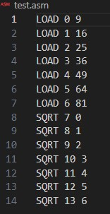
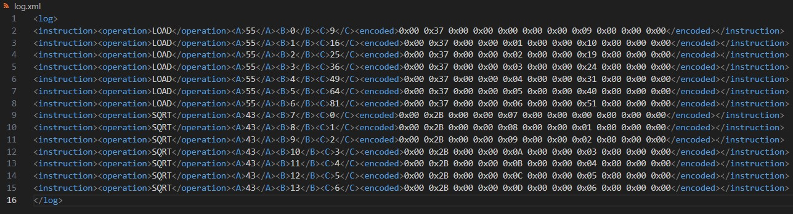
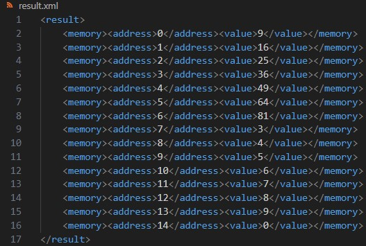

# Assembler
Четвёртое домашнее задание по Конфигурационному Управлению

## Постановка задачи

### Задание №1
Разработать ассемблер и интерпретатор для учебной виртуальной машины (УВМ). Система команд УВМ представлена далее.
Для ассемблера необходимо разработать читаемое представление команд УВМ.
Ассемблер принимает на вход файл с текстом исходной программы, путь к которой задается из командной строки.

Результатом работы ассемблера является бинарный файл в виде последовательности байт, путь к которому задается из 22 командной строки.
Дополнительный ключ командной строки задает путь к файлулогу, в котором хранятся ассемблированные инструкции в духе списков “ключ=значение”, как в приведенных далее тестах.
Интерпретатор принимает на вход бинарный файл, выполняет команды УВМ и сохраняет в файле-результате значения из диапазона памяти УВМ.
Диапазон также указывается из командной строки. Форматом для файла-лога и файла-результата является xml.
Необходимо реализовать приведенные тесты для всех команд, а также написать и отладить тестовую программу.

#### Загрузка константы:
| A | B | C |
| ----------- | ----------- | ----------- |
| Биты 0-6    | Биты 7—30   | Биты 31—58   |
| 55    | Адрес   | Константа   |

Размер команды: 11 байт. 

Операнд: поле C.

Результат: значение в памяти по адресу, которым является поле B. 

Тест (A=55, B=615, C=715): 0xB7, 0x33, 0x01, 0x80, 0x65, 0x01, 0x00, 0x00, 0x00, 0x00, 0x00

#### Чтение значения из памяти:
| A | B | C |
| ----------- | ----------- | ----------- |
| Биты 0-6    | Биты 7—30   | Биты 31—54   |
| 119    | Адрес   | Адрес  |

Размер команды: 11 байт.

Операнд: значение в памяти по адресу, которым является значение в памяти по адресу, которым является поле C.

Результат: значение в памяти по адресу, которым является поле B.

Тест (A=119, B=448, C=880): 0x77, 0xE0, 0x00, 0x00, 0xB8, 0x01, 0x00, 0x00, 0x00, 0x00, 0x00

#### Запись значения в память:
| A | B | C | D |
| ----------- | ----------- | ----------- | ----------- |
| Биты 0-6    | Биты 7—30   | Биты 31—54   | Биты 55—63   |
| 80    | Адрес   | Адрес  | Смещение  |

Размер команды: 11 байт. 

Операнд: значение в памяти по адресу, которым является поле C. 

Результат: значение в памяти по адресу, которым является сумма адреса (значение в памяти по адресу, которым является поле B) и смещения (поле D).

Тест (A=80, B=342, C=103, D=294): 0x50, 0xAB, 0x00, 0x80, 0x33, 0x00, 0x00, 0x93, 0x00, 0x00, 0x00

#### Унарная операция: sqrt():
| A | B | C |
| ----------- | ----------- | ----------- |
| Биты 0-6    | Биты 7—30   | Биты 31—54   |
| 43    | Адрес   | Адрес  |

Размер команды: 11 байт.

Операнд: значение в памяти по адресу, которым является поле C.

Результат: значение в памяти по адресу, которым является значение в памяти по адресу, которым является поле B.

Тест (A=43, B=891, C=580): 0xAB, 0xBD, 0x01, 0x00, 0x22, 0x01, 0x00, 0x00, 0x00, 0x00, 0x00

#### Тестовая программа:
Выполнить поэлементно операцию sqrt() над вектором длины 7. Результат записать в новый вектор.

#### Запуск:

Для запуска ввести в консоль: 

```python3 assembler.py <input_asm> <output_bin> <output_log>```

Далее:

```python3 assembler.py <input_bin> <memory_range> <output_result>```

## Описание алгоритма

### assembler.py
Цель: Преобразование текстовой программы в бинарный формат и сохранение логов.

Функция assemble_command:

 - Преобразует команду в бинарный формат. Каждая команда состоит из операции (например, LOAD, READ), двух или трех параметров (b, c, d), которые кодируются в битах, и преобразует их в 11-байтовое бинарное представление.
 - Операции кодируются с помощью заданных значений (например, LOAD = 55).

Функция assembler:

- Читает входной текстовый файл с программой.
- Для каждой строки программы:
- Извлекаются операционная команда и параметры (b, c, d).
- Преобразует команду в бинарный формат с помощью assemble_command.
- Логирует инструкцию (операцию, параметры и бинарное представление) в XML-формате.
- Сохраняет сгенерированные бинарные данные в файл и логи в формате XML.

### interpreter.py
Цель: Выполнение бинарной программы на виртуальной машине (УВМ) с сохранением состояния памяти.

Функция execute_command:

- Извлекает операнды из 11-байтовой команды (a, b, c, d).
- Выполняет соответствующую операцию в зависимости от значения a:
- LOAD: Загружает значение в память.
- READ: Читает значение из памяти по адресу, заданному в параметре c, и сохраняет в b.
- WRITE: Пишет значение в память с учетом смещения d.
- SQRT: Извлекает квадратный корень из значения в памяти и сохраняет результат в b.

Функция interpreter:

- Загружает бинарный файл с программой.
- Для каждой команды выполняет execute_command на виртуальной машине.
- После выполнения программы сохраняет состояние памяти в XML-формате в пределах заданного диапазона памяти.

## Тестирование программы

1. asm файл:



2. log файл:



3. result файл:


